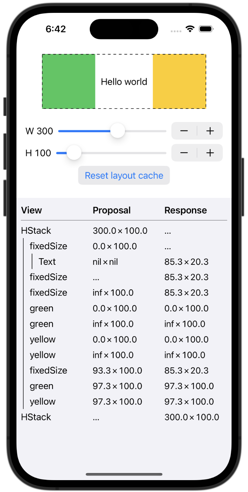

# SwiftUI Layout Inspector

By [Ole Begemann](https://oleb.net/)

A Swift library (and demo app) for learning how the SwiftUI layout system works,
and for debugging your own layout code. Inspect the layout behavior of SwiftUI
views, i.e. what sizes views propose to their children and how a view determines
its own size.

## Motivation

At its core, SwiftUI’s layout algorithm is wonderfully simple:

1.  Each parent view proposes a size to its child view(s). Width and height are
    both optional values; either one (or both) can be `nil`.

2.  The child view determines its own size, taking the proposed size into
    account, as well as the sizes of its own children (it’s a recursive
    process).
    
3.  The child reports its size back to its parent. The parent cannot change the
    size: in SwiftUI, each view determines its own size.
    
4.  The parent view positions its children.

Complex layouts in SwiftUI can be achieved by composing built-in views and view
modifiers. The tricky part about understanding the SwiftUI layout system is
learning the layout behavior of the built-in views. This package aims to help
you learn.

## Components

Layout Inspector consists of:

- The `LayoutInspector` library, provided as a SwiftPM package. Add it to your
  own SwiftUI app to debug your layout code.

- The `LayoutInspectorDemo` app, an iOS and Mac app that shows Layout Inspector
  in action.

## Requirements

iOS 16.0 or macOS 13.0 (requires the `Layout` protocol).

## Instructions

1.  `import LayoutInspector`
    
2.  Add `.debugLayout()` at each point in a view tree where you want to inspect
    the layout algorithm (what sizes are being proposed and returned).
    
3.  At the top of the view tree you want to inspect, add `.startDebugLayout()`.

See the README of the demo app for a complete example.

## Acknowledgements

Idea and initial code based on: [objc.io, Swift Talk episode 318, Inspecting SwiftUI's Layout Process (2022-08-19)](https://talk.objc.io/episodes/S01E318-inspecting-swiftui-s-layout-process)

Runtime warnings in Xcode: [Point-Free, Unobtrusive runtime warnings for libraries (2022-01-03)](https://www.pointfree.co/blog/posts/70-unobtrusive-runtime-warnings-for-libraries)
